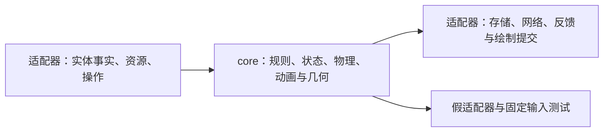

# Halo 项目开发指南

本文面向人类开发者和 coding agent，说明如何在 Halo / HaloCore 双仓库结构下开发功能、调试、验收、适配其他 Minecraft 版本并推送远端。详细类型契约以 [HaloCore README](core/README.md) 为准，架构背景见 [core-refactor.md](docs/core-refactor.md)。

当前开发主线是 Halo 的 `1.20.1-fabric`，core 的集成分支是 `main`，已验收的重构基准为双方的 `v1.3.1`。主线不一定名为 `main`；开始任务时应检查实际分支。所有 `*-flash` 分支保持冻结。

**常规流程：先定义功能的数据与规则 → 在 core 实现和验证 → 在主线实现适配器并联调 → 发布确定的 core 提交 → 提交主线的适配器及 core 指针 → 按需更新其他版本的指针和适配器 → 分别验收、推送和发布。** 不要求所有游戏版本同时跟进。

文中的 `entity-opacity`（根据实体状态调整光环透明度）、`1.4.0` 和 `1.21.1-fabric` 是完整流程的示例，不代表已实现的功能或已存在的版本。编写本文时仅存在 `1.21.1-fabric-flash`，不存在已迁移的新架构 `1.21.1-fabric` 分支。

## 阅读路线

- [1. 两个仓库如何协作](#repositories)
- [2. 新功能从哪里开始](#feature)
- [3. 编译、调试与验收](#validation)
- [4. 提交和发布主线功能](#publish-main)
- [5. 迁移到另一个游戏版本](#port)
- [6. 版本、标签与维护规则](#versions)
- [7. 交付记录与常见问题](#handoff)

<a id="repositories"></a>

## 1. 两个仓库如何协作

| 位置 | 责任 | Git 中保存什么 |
| --- | --- | --- |
| Halo 根目录 | Minecraft / 加载器适配、内置内容、联合构建、平台测试 | 适配层源码，以及 `core` 的一个精确提交指针 |
| `core/`，独立的 HaloCore 仓库 | 定义解析、业务状态、锚点仲裁、物理、动画、几何 | 自己的源码、测试、版本、文档和提交历史 |

Git submodule 负责**锁定源码提交**；Gradle `includeBuild("core")` 负责**直接编译当前 core 工作树**。开发期间修改 `core/src` 后，Halo 下一次构建就会使用它，不需要先安装 Maven 包、复制 JAR 或推送远端。玩家仍只安装一个合并后的 Halo JAR。

`git add core` 只暂存子模块指针，**不会提交 core 内的源码修改**。所以需要分别检查两个仓库：

```powershell
# 命令从 Halo 根目录执行；以下示例使用 PowerShell。
git status --short --branch
git -C core status --short --branch
git ls-tree HEAD core
git -C core rev-parse HEAD
```

最后两条分别给出 Halo 已提交的 core 指针和当前 core HEAD。发布时二者必须相等；开发时不相等是正常的过渡状态。

首次检出：

```powershell
git clone --branch 1.20.1-fabric --recurse-submodules https://github.com/AzusaKe/Halo.git
Set-Location Halo
```

已有克隆缺少子模块时执行 `git submodule update --init --recursive`。该命令恢复 Halo 已锁定的版本；它不负责寻找最新功能。开发中的 core 有未提交修改或尚未记录的提交时，先保存这些工作，再执行切换或恢复操作。

Linux/macOS 将示例中的 `Set-Location` 换成 `cd`、`.\gradlew.bat` 换成 `./gradlew`、`.\core\gradlew.bat` 换成 `./core/gradlew`。所有示例都按阶段执行；某一步失败，应先处理原因，再继续后续提交或推送。

<a id="feature"></a>

## 2. 新功能从哪里开始

### 2.1 从主线锁定的 core 建立两个工作分支

先确认两个工作树没有未处理的修改。用户已有的更改需要保留和识别，不用 `reset --hard` 或清理目录来获得“干净环境”。以下分支名仅为示例，创建前先确认没有同名工作分支。

```powershell
git fetch origin
git switch 1.20.1-fabric
git pull --ff-only origin 1.20.1-fabric
git submodule update --init --recursive
git switch -c codex/entity-opacity-1.20.1

git -C core fetch origin --tags
git -C core switch -c codex/entity-opacity
```

core 工作分支从**当前主线锁定的提交**开始。子模块检出后处于 detached HEAD 是正常现象，但要修改 core 时应先建立工作分支，便于保存和找回提交。不要直接切到 `origin/main` 或使用 `git submodule update --remote`，让尚未验证的变化混入本次功能。

### 2.2 先写清行为和数据契约，再实现

用一段设计说明回答以下问题，可放在本次 PR 或 `docs/` 的功能文档中：

1. 什么输入触发功能，预期输出是什么？旧定义、旧存档和缺少新字段时采用什么默认值？
2. 哪些状态属于服务器权威，哪些属于客户端表现？什么时候创建、更新、恢复和销毁？
3. core 需要哪些实体事实、时间、配置或外部服务？每项数据的单位、坐标系和有效期是什么？
4. 是否改变 JSON、存档、网络协议或外部 API？若需要改变，明确兼容和迁移方式。
5. 如何用固定输入证明行为正确？主线和目标游戏版本分别需要哪些实际游戏用例？

优先复用现有契约；信息不足时才新增或扩展 core 接口。接口表达功能所需的数据，不接收一个能任意读取 Minecraft 的大 `Platform` 对象。

以“根据下蹲状态调整透明度”为例：core 定义透明度规则、过渡行为和缺省值；如果现有帧输入没有所需状态，就增加中立的姿态事实或快照。1.20.1 Fabric 适配器采集该事实，core 计算动画与颜色，绘制适配器消费结果。以后 1.21.1 只需按该版本 API 提供相同事实、提交相同语义的绘制结果，不能再写一套透明度状态机。

### 2.3 按责任放置代码

| 改动 | 主要入口 |
| --- | --- |
| 定义、默认值、配置合并和资源来源规则 | `core/src/main/java/network/azusake/halo/json/`、`config/`、`core/runtime/DefinitionResources.java` |
| 佩戴、生命周期、客户端副本、本地模式 | `core/.../core/runtime/ServerRuntime.java`、`ClientRuntime.java`、`ClientPort.java`、`LocalOwnership.java` |
| 帧输入与输出契约 | `core/.../core/render/FrameScene.java`、`BodyPose.java`、`DrawBatch.java` |
| 锚点数学、物理、动画、几何 | `core/.../anchor/`、`physics/`、`animation/`、`render/`、`shape/` |
| Minecraft 事实采集、线程与单人桥接 | `src/main/java/network/azusake/halo/platform/`、`anchor/`、`physics/`、`HaloModClient.java` |
| 资源枚举、文件/NBT、Fabric 通信 | Halo 的 `json/`、`lifecycle/`、`network/`；网络字节布局集中在 `HaloPacketCodec` |
| 指令、权杖输入、GUI、聊天、GPU 提交 | Halo 的 `command/`、`item/`、`client/`、`render/HaloRenderer.java` |
| 内置定义、纹理、配方、语言和实体适配资源 | Halo 的 `src/main/resources/`；core 测试使用 `core/src/test/resources/` 内的独立样例 |

上表中的 `core/.../` 省略了共同前缀 `core/src/main/java/network/azusake/halo/`；Halo 包目录共同前缀为 `src/main/java/network/azusake/halo/`。

core 保持 Java 17，不引入 Minecraft、Fabric、Mixin 或图形 API。Gson 2.10 和 JOML 1.10.5 是内部实现依赖；对适配器公开的契约使用 core/JDK 类型。`public` 的旧数学或定义实现类不自动成为稳定接入接口。

新功能应沿用已有的数据方向：



保留服务器与客户端的独立运行实例。网络接收器调用客户端业务入口，不读取渲染器私有状态；物理输出再叠加视觉动画；暂时不可见、实体卸载或定义缺失不等于撤销佩戴。线程、坐标和资源优先级的完整约束见 [core 契约](core/README.md)。

<a id="validation"></a>

## 3. 编译、调试与验收

### 3.1 先验证核心行为，再做联合构建

主线使用 Java 17、Gradle wrapper 8.8 和固定 Loom 1.5.8。始终使用仓库的 wrapper。以下命令从 Halo 根目录执行：

```powershell
# 快速重放与功能相关的 core 用例；测试类按实际改动选择。
.\core\gradlew.bat -p core test --tests 'network.azusake.halo.core.runtime.RuntimePipelineTest' --console=plain

# 不经过 Loom 的 core 独立构建和边界检查。
.\core\gradlew.bat -p core build --console=plain

# Halo + core 的联合构建、测试、JAR 内容及旧 API v2 调用方检查。
.\gradlew.bat build --console=plain
```

业务测试放在 core，通过假存储、消息回调、实体/相机输入和固定时间驱动功能。涉及画面的功能应覆盖“帧输入 → 物理 → 动画 → 绘制批次”，而不只测试公式。可参考 `RuntimePipelineTest`、`StorageAndLifecycleTest`、`AdapterContractTest`。平台测试验证协议字节、NBT 往返、适配数学和第三方 ABI；不要用只检查私有字段的测试替代行为验证。

任一工作树有未提交内容，或当前 core HEAD 不等于 Halo 已提交的 gitlink 时，普通构建生成 `.dev` 版本。这正是双仓库联调的正常状态。正式发布检查要到[提交顺序](#publish-main)完成后执行。

### 3.2 启动游戏和连接调试器

| 命令 | 当前主线的运行目录 |
| --- | --- |
| `.\gradlew.bat runClient --console=plain` | `run/`，Dev1 |
| `.\gradlew.bat runClient2 --console=plain` | `run2/`，Dev2 |
| `.\gradlew.bat runServer --console=plain` | `runServer/1.20.1-fabric/` |
| `.\gradlew.bat runSmokeServer --console=plain` | `.local/smoke-server/` |
| `.\gradlew.bat runSmokeClient --console=plain` | `.local/smoke-client/` |
| `.\gradlew.bat runSmokeClient2 --console=plain` | `.local/smoke-client2/` |

服务端和两个客户端分别在不同终端启动。首次服务端启动按提示处理该运行目录的 EULA 和 `server.properties`。仅在本机联调时，开发账号使用允许离线账号的测试服，并绑定 `server-ip=127.0.0.1`；通过该目录配置的端口连接。不同游戏版本使用独立世界和配置，不把较新版本存档交给较老版本加载。

隔离客户端可直接连接测试服，例如已将 smoke-server 端口配置为 25579 时：

```powershell
.\gradlew.bat runSmokeClient '-PsmokeServerAddress=127.0.0.1:25579' --console=plain
.\gradlew.bat runSmokeClient2 '-PsmokeServerAddress=127.0.0.1:25579' --console=plain
```

进入既有隔离单人世界可用 `'-PsmokeWorldName=世界目录名'`，目录位于 `.local/smoke-client/saves/`。它与 `smokeServerAddress` 二选一。

IDE 导入根 Gradle 工程及 included build；断点可以同时设在适配器和 core。需要远程附加调试时：

```powershell
.\gradlew.bat runClient --debug-jvm --console=plain
```

该 JavaExec 调试模式默认在 5005 端口等待调试器，可在 IDE 附加到 `localhost:5005`。多人调试时一次只给一个进程使用该默认调试端口，或在目标分支的运行配置中为各进程设置不同端口。优先按“适配器输入 → core 状态/帧输出 → 适配器提交”定位问题。

Java 代码或 core 改动后，重新构建并重启相关游戏进程。每次启动会复制独立 core JAR，正在运行的旧 JVM 不会自动切换到新实现。不要在开发游戏仍运行时执行 `clean`。

资源包改动通过客户端资源重载（F3+T 或资源包界面）验证；服务器数据包通过 `/reload` 验证。两者不是同一次重载。日志在相应运行目录的 `logs/latest.log`，崩溃报告在 `crash-reports/`。服务端出现 `Done (...)!` 才代表加载完成；`BUILD SUCCESSFUL` 只表示 Gradle 任务正常退出。服务端用控制台 `stop` 保存并退出。

### 3.3 验收通过后才向其他版本迁移

| 层次 | 应提供的证据 |
| --- | --- |
| core 行为 | 正常路径、边界/默认值、资源恢复、固定时间下的预期输出；新接口可由假适配器驱动 |
| 构建与兼容 | 联合构建通过；核心边界、JAR 合并、旧 API v2、受影响的 JSON/NBT/协议检查通过 |
| 游戏运行 | 单人、专用服双客户端、无 Halo 服务端的本地模式；新功能及受影响的指令/权杖/重载流程 |
| 生命周期与画面 | 受影响的挂载/隐藏、死亡/重生、卸载/重连/换维度、睡眠/隐身；动画、视角、大坐标与绘制状态 |
| 第三方兼容 | 涉及渲染/锚点时，在实际 EMF/YSM/Iris 组合验证，记录使用的版本与光影环境 |

按改动选择有意义的用例，不要求每次文档或低影响修复重跑所有游戏场景；行为接口变化和首次平台接入应做完整相关验证。缺少外部 YSM 发布包时，`YsmReleaseSignatureTest` 会跳过，可通过 `HALO_YSM_TEST_JAR` 指定测试包。记录跳过和未验证项，不能把“可编译”写成“游戏验证通过”。

<a id="publish-main"></a>

## 4. 提交和发布主线功能

### 4.1 先确定版本和提交范围

假设新功能确定为 `1.4.0`：更新 `core/gradle.properties` 的 `version`，补充 `core/CHANGELOG.md` 和接口迁移说明；Halo 从该文件读取功能版本，更新根 `CHANGELOG.md`、相关文档和本次验收记录。适配修订由根 `gradle.properties` 的 `adapter_revision` 管理，示例使用 1。

提交前分别查看两个仓库的 diff，逐项暂存本次工作。下面 `git add` 的路径是示例集合，需按实际变更增减；特别是新增资源、构建文件和 CI 不能遗漏，也不能夹带无关工作。

### 4.2 提交、集成并推送 core

以下命令假设两个工作分支仍为第 2 节的分支，并已完成相关验收。示例采用直接维护分支且可 fast-forward 的仓库流程；如果使用 PR，将合并步骤换成对应仓库的 PR 合并。

```powershell
git -C core add -- src README.md CHANGELOG.md gradle.properties
git -C core diff --cached
git -C core diff --cached --check
git -C core commit -m 'feat: add entity-driven halo opacity'

git -C core switch main
git -C core pull --ff-only origin main
git -C core merge --ff-only codex/entity-opacity
git -C core rev-parse HEAD
git -C core tag -a v1.4.0 -m 'HaloCore 1.4.0'
git -C core push --atomic origin main refs/tags/v1.4.0
```

`--ff-only` 失败表示基线发生了分叉。回到工作分支集成变化、解决冲突并重做受影响的验证，再继续；不要强推或覆盖已有发布。PR 的 squash/rebase 合并可能改变最终 SHA，**Halo 必须锁定实际合并后的 core 提交**，不能继续使用合并前的临时 SHA。

如需在完成前推送协作分支，先执行 `git -C core push -u origin codex/entity-opacity`。随后在 Halo 提交适配改动和该 core 指针，再执行 `git push -u origin codex/entity-opacity-1.20.1`。Halo 工作分支只有在它引用的 core 提交已可从远端取得后再推送，避免其他开发者或 CI 无法检出。协作分支推送不等于给 core 版本打正式标签。

### 4.3 锁定已发布 core，提交并验证 Halo

确认刚刚推送成功，然后将 Halo 中的 core 检出到该确定版本：

```powershell
git -C core fetch origin --tags
git -C core switch --detach v1.4.0
git -C core rev-parse HEAD

# 包含 core 指针、适配器、资源、版本说明和验收记录。
git add -- core src gradle.properties CHANGELOG.md docs README.md README_ZH.md
git diff --cached --submodule=short
git diff --cached --check
git commit -m 'feat: adapt entity opacity on Minecraft 1.20.1 Fabric'

git switch 1.20.1-fabric
git pull --ff-only origin 1.20.1-fabric
git merge --ff-only codex/entity-opacity-1.20.1
git submodule update --init --recursive
git status --short
git -C core status --short

.\gradlew.bat build -Prelease=true --console=plain
```

如果之前已经分批提交了相同改动，无需制造空提交；确认最终 gitlink 与版本正确即可。主线有新提交或 PR 合并改变了适配代码时，重新验证最终合并结果。

发布构建要求 Halo/core **两个工作树干净**，当前 core HEAD 等于 Halo **已提交**的 gitlink，而且该精确提交能从 core 的 `origin` 获取。因此必须先提交并推送 core，再提交 Halo 指针，最后运行 `-Prelease=true`；仅暂存 `core` 不够。正式检查失败时，不用去掉参数或只重命名 `.dev` 文件来发布。

检查 `build/libs/` 中的成品以及 JAR 内 `fabric.mod.json`、`halo-build.json`：功能版本应为预定版本，适配修订正确，`development=false`，`coreCommit` 与 `coreLock` 一致，`haloCommit` 对应本次构建提交。最终 Halo 提交改变后要重新构建，避免成品内记录旧提交。

### 4.4 推送 Halo 分支，按需要发布版本标签

```powershell
git push origin 1.20.1-fabric
```

查看该提交的 CI 结果。需要正式发布成品时，再创建唯一的目标平台标签，例如：

```powershell
git tag -a v1.4.0-fabric-1.20.1-adapter.1 -m 'Halo 1.4.0 for Minecraft 1.20.1 Fabric, adapter 1'
git push origin refs/tags/v1.4.0-fabric-1.20.1-adapter.1
```

当前 [Halo CI](.github/workflows/gradle.yml) 会递归检出子模块；主线分支/PR 触发构建，`v*` 标签触发正式构建并自动创建 GitHub Release、上传 JAR。只需要备份源码时推送分支即可；正式标签推送也是发布动作。core 的 CI 独立运行构建，不能替代 Halo 的平台验证。

推送后检查远端引用和 CI，而不仅看本地标签：

```powershell
git -C core ls-remote origin refs/heads/main refs/tags/v1.4.0 'refs/tags/v1.4.0^{}'
git ls-remote origin refs/heads/1.20.1-fabric refs/tags/v1.4.0-fabric-1.20.1-adapter.1 'refs/tags/v1.4.0-fabric-1.20.1-adapter.1^{}'
git status --short --branch
git -C core status --short --branch
```

附注标签的 `^{}` 行是其对应的提交 SHA，应与验收的提交一致。两个仓库没有跨仓库原子推送：如果 core 已推送而 Halo 推送失败，保留已发布 core，解决 Halo 问题后继续推送，不回滚或移动 core 标签。

<a id="port"></a>

## 5. 迁移到另一个游戏版本

### 5.1 已有采用新架构的 `1.21.1-fabric`

先在远端确认分支存在，并确认它已经具有 `core` 子模块、composite build 和对应适配器。建议为不同游戏版本使用独立递归克隆，避免运行中的游戏、Gradle 输出和子模块工作分支互相影响。

```powershell
# 此时位于原 Halo 根目录；只在目标分支确实存在时执行。
git ls-remote --heads origin refs/heads/1.21.1-fabric
git clone --branch 1.21.1-fabric --recurse-submodules https://github.com/AzusaKe/Halo.git ../Halo-1.21.1-fabric
Set-Location ../Halo-1.21.1-fabric
git switch -c codex/entity-opacity-1.21.1

git -C core fetch origin --tags
git -C core switch --detach v1.4.0
git -C core rev-parse HEAD
git diff --submodule=short -- core
```

这里的“最新 core”指本次主线已经验收的 `v1.4.0` 所对应的精确提交，即使此时 core `main` 上已经有后续开发，也不自动引入。也可按评估结果选择另一个已验证的 SHA，但需记录选择依据和迁移范围。

从目标分支原来的 core 版本到选定版本，阅读所有相关 changelog/接口差异；休眠分支可能跨过多次变更。随后完成：

1. 补齐新输入、回调和输出的适配：实体/相机事实、生命周期、资源/存储、通信/线程、光照与 GPU 提交。
2. 迁入新功能需要的内置 JSON、纹理、语言、配方及适配测试。这些内容保存在 Halo，更新 core 指针不会自动带来它们。
3. 适配目标版本的 Minecraft、加载器、mappings、Mixin 和第三方 ABI。已有 1.21.1 旧分支使用 Java 21；不要把主线的 Java 17、Loom 1.5.8 和渲染 API 原样当作所有目标版本的配置。core 仍编译为 Java 17。
4. 核对运行目录、版本/JAR 命名及 CI。当前主线 workflow 的分支过滤只包含 `1.20.1-fabric`，目标分支要显式配置自己的 push/PR 目标和 JDK，同时保留递归子模块检出、core 检查、合包与提交来源验证。
5. 在目标环境执行独立 core 检查、联合构建、第 3 节中受影响的游戏验证及兼容验证，再提交该分支的指针和适配改动。

**不要整条合并 `1.20.1-fabric` 来获得功能，也不要把 core 的业务实现复制回目标 Halo 源码。** 可按内容选取确实通用的资源/文档/测试提交或补丁，平台相关代码必须针对目标 API 检查。编译错误消失仅表示接口已接通，还需验证坐标、时序、生命周期与视觉效果。

如果发现 core 契约缺少通用能力，应回到 core 和开发主线共同修订并验证，发布新的 core 提交/版本，然后让需要该能力的分支重新选择它。不要在 1.21.1 适配层补一套私有业务算法，也不要修改已发布标签指向。只有平台 API 接法不同的改动留在目标适配层。

### 5.2 提交并推送目标版本

继续在 `Halo-1.21.1-fabric` 克隆中执行；以下阶段以该分支适配和游戏验证完成为前提。core 没有变化时不用创建 core 提交、提升 core 版本或再次发布 core。

```powershell
git -C core status --short
git add -- core src gradle.properties build.gradle settings.gradle .github/workflows/gradle.yml CHANGELOG.md docs README.md README_ZH.md
git diff --cached --submodule=short
git diff --cached --check
git commit -m 'feat: adapt HaloCore 1.4.0 to Minecraft 1.21.1 Fabric'

git switch 1.21.1-fabric
git pull --ff-only origin 1.21.1-fabric
git merge --ff-only codex/entity-opacity-1.21.1
git submodule update --init --recursive
.\gradlew.bat build -Prelease=true --console=plain
git push origin 1.21.1-fabric
```

核对目标成品的版本与提交来源、等待目标分支 CI 通过，需要正式发布时：

```powershell
git tag -a v1.4.0-fabric-1.21.1-adapter.1 -m 'Halo 1.4.0 for Minecraft 1.21.1 Fabric, adapter 1'
git push origin refs/tags/v1.4.0-fabric-1.21.1-adapter.1
git ls-remote origin refs/heads/1.21.1-fabric 'refs/tags/v1.4.0-fabric-1.21.1-adapter.1^{}'
```

示例假设该目标版本在 core 1.4.0 上的适配修订为 1；若配置不同，成品和标签中的适配修订必须同步调整。主线和 1.21.1 可锁定相同 core SHA，但各自有不同的 Halo 提交与发布标签。无需为了平台适配再把 1.21.1 分支合并回主线。

### 5.3 目标分支还不存在，或只剩旧 flash 代码

这属于一次**平台接入**，工作量比更新已迁移的适配器更大。优先从已验证的新架构发布标签创建新的活动分支，再迁移该版本适配器；旧 flash 仅作为平台代码的参考。下面使用第 4 节发布的主线标签：

```powershell
# 在另一个克隆中操作，目录和分支均应尚未存在。
git clone --branch v1.4.0-fabric-1.20.1-adapter.1 --recurse-submodules https://github.com/AzusaKe/Halo.git ../Halo-1.21.1-fabric
Set-Location ../Halo-1.21.1-fabric
git switch -c 1.21.1-fabric
```

按 5.1 的清单更改目标游戏/加载器配置、适配器和运行环境。若维护者选择从旧目标版本源码开始，也必须先完成子模块、联合构建和业务职责提取，移除旧的重复业务实现；“添加一个 core 依赖”不等于完成迁移。

首次分支尚无远端上游，不能照搬 5.2 中的 `pull origin 1.21.1-fabric`。先完成本地适配提交和发布验证，再用 `git push -u origin 1.21.1-fabric` 创建远端分支，后续按目标平台标签发布。不得重命名、覆盖或推送修改到 `1.21.1-fabric-flash`。

<a id="versions"></a>

## 6. 版本、标签与维护规则

| 项目 | 规则 |
| --- | --- |
| core 功能版本 | 来源为 `core/gradle.properties`。新功能/行为修复按影响选择新版本，并记录接口和兼容变化；文档/忽略规则维护可保持版本 |
| Halo 功能版本 | 从选定 core 读取，不再在根目录维护另一个独立 `mod_version` |
| 适配修订 | 来源为根 `gradle.properties` 的 `adapter_revision`。同一功能版本的纯平台修复递增该值；每次发布明确本平台修订 |
| schema / 存档 / 协议 / 外部 API | 与功能版本分开管理，不因功能版本号变化就自动改格式或破坏兼容。现有 schema 为 1.0.10，外部锚点 API 为 v2 |
| 源码锁定 | Halo 提交中的 core gitlink 是唯一锁定依据；标签用于识别发布，不替代 SHA 锁定 |
| 标签 | Git 标签在同一仓库中跨分支共享。core 可用 `v1.4.0`；Halo 多平台发布建议带游戏版本、加载器和适配修订，避免同名冲突 |

已发布的 `v1.3.1` 等标签保持不动。后续文档提交可以让分支前进，但不会改写这个验收基准。功能修复涉及 core 时先提交/推送 core，再更新所需 Halo 分支；纯适配或 Halo 文档修复只需提交 Halo。未计划适配的分支继续锁定原 core，不强制升级。

标签本身不是当前构建门禁的必要条件：一个已提交、远端可获取且被 Halo 精确锁定的 core 维护提交也可通过 `-Prelease=true`。正式功能版本仍应按上文建立版本标签和变更记录。不要把“保持版本号的文档提交”与“偷偷改变已发布功能”混为一谈。

<a id="handoff"></a>

## 7. 交付记录与常见问题

每项工作结束时，人类和 agent 都应给出同样可复核的记录：

- 功能行为、改动的 core 契约和适配器；采用的 core 版本/SHA、Halo 分支/SHA及适配修订。
- 构建命令和结果；相关自动测试、实际游戏/多人验证、第三方组合、跳过或未验证项目。
- 成品路径和版本；两个仓库是否干净，提交/推送/CI/标签/Release 分别完成到哪一步。
- 已完成适配的目标分支，以及明确留在原版本的分支。不把一个平台的验收结果扩展成所有平台都通过。

| 现象 | 处理方式 |
| --- | --- |
| 主仓库只显示 `core` 改动 | 用 `git -C core status` 和 `git diff --submodule=short -- core` 区分内部未提交修改与指针变化；源码先在 core 提交 |
| 想切换游戏版本但 core 中仍有工作 | 先保存到 core 工作分支，确认提交可找回；不要靠 submodule update 覆盖当前开发树。并行开发优先使用独立克隆 |
| 编译仍出现 `.dev` | 检查两个工作树及 Halo **已提交**的 gitlink；core 提交后还需要在 Halo 中提交新指针 |
| core 版本号相同但提交不同 | 检查实际 SHA 和 changelog；版本字符串不能替代源码锁定，维护提交可以保持功能版本 |
| 正式构建提示 core 远端不可获取 | 先推送正确的 core 分支/提交并检查 `origin`；仅本地存在对象或 remote-tracking 缓存不算可获取 |
| 更新 core 后“功能没出现” | 核对客户端运行的 JAR/提交、所需 Halo 资源、适配器输入和缓存；更新子模块不会热替换旧 JVM，也不会同步 Halo 资源 |
| 编译成功但服务端未启动 | 查看对应目录日志，确认 `Done`；检查端口、EULA、目标版本世界和配置，不把 Gradle 成功当作服务端成功 |
| 新版本分支没有 CI | 检查目标分支自身 workflow 的 push/PR 过滤、JDK、递归检出与构建任务 |
| 只是修改本指南 | 修改 Halo 文档及必要入口即可，不修改 core 版本/指针或现有发布标签；验证文档链接和命令说明，无需重跑整套游戏测试 |

其他入口：[项目 README](README_ZH.md)、[架构和适配清单](docs/core-refactor.md)、[core 数据契约](core/README.md)、[版本记录](CHANGELOG.md)、[重构验收记录](docs/refactor-verification.md)。
