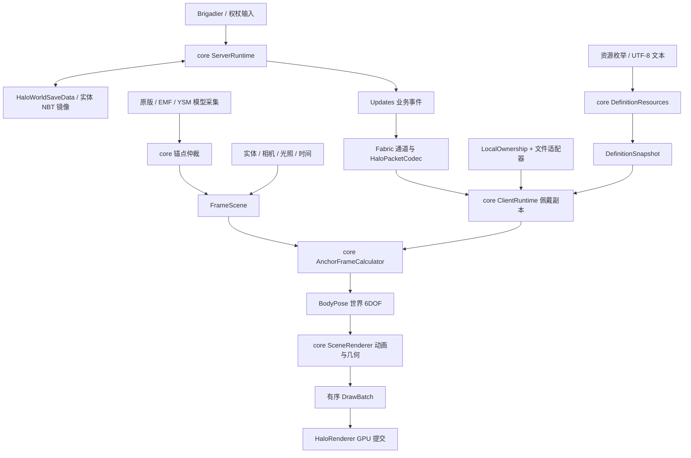

# 1.20.1 Fabric / HaloCore 开发说明

本次架构拆分从 `1.20.1-fabric` 的 `b30dad7` 开始，保留此前两个本地提交。
功能版本仍为 **1.3.0**，定义 schema 仍为 **1.0.10**。其他 flash 分支不迁移、不回合并；
它们的冻结由分支和发布说明表达。

## 实际边界与数据流



`core/README.md` 是新平台接入的数据契约与坐标规范。适配层不重新实现阻尼、动画、组继承、
几何或佩戴规则。保留旧包名的实现类便于数值回归；它们不等于面向新适配器的稳定接口。

| 旧责任 | 当前实现 |
| --- | --- |
| 定义模型、JSON 解析、动画/数学/图元 | core 原同名包；资源入口为 `DefinitionResources` |
| 共享 HaloManager 可变实例 | `ServerRuntime` 权威状态 + 独立 `ClientRuntime` 表现状态 |
| 世界数据/NBT | Halo `HaloWorldSaveData` / `HaloEntityData` 存储适配 |
| 本地 JSON 与连接阶段规则 | core `LocalOwnership` / `ConnectionMode`；Halo 只提供文件及连接事实 |
| 网络驱动关闭动画 | 网络仅解码；`ClientRuntime.hide` 自行冻结最近绘制状态并进入关闭动画 |
| AnchorFrameCalculator 内实体查询 | Halo 提供帧样本；core 计算位置和旋转 |
| HaloRenderer 大量 CPU 算法 | core `SceneRenderer`；Halo 消费已变换的顶点和渲染状态 |
| 第三方模型的矩阵/骨骼数学 | core `CapturedModelMath` / `LocatorMath`，Halo 保留反射与 Mixin |
| 权杖选择/会话规则 | core `ScepterPolicy` / `HaloScepterSessionStore` |
| 重复可见性/空转服务端驱动 | 删除旧客户端状态缓存和空 heartbeat；保留事件与一次维护 tick |

## 状态所有权

每个 MinecraftServer 绑定一个服务端 core 实例。世界存档是持久佩戴的权威；实体 NBT 保持原格式的镜像。
玩家死亡保留持久记录，重生恢复；非玩家死亡清除持久记录。卸载只移除活动记录，显式隐藏才撤销佩戴并发送 remove。

每个逻辑客户端独占佩戴副本、动画、物理缓存和最近绘制状态。实体未加载、暂时不可见或定义缺失不撤销佩戴。
换世界和实体卸载清理对应表现缓存；断连清理服务器副本与锚点捕获，本地文件保留。
睡眠和隐身遵循原定义的显示/过渡规则。重复网络消息不重启动画。

单人游戏同样通过原有网络入口更新客户端副本。运行时配置经 `RuntimeConfigSnapshot` 投递到客户端主线程，
客户端诊断经 `ClientStatus` 不可变快照提供给服务端查询。没有新增远程配置包。
资源目录在解析结束后原子发布；server data 来源优先级 0，client assets 来源优先级 1。
客户端覆盖同 ID 的服务器定义，服务器重载或退出不会删除客户端来源。重载失效解析缓存，不重置佩戴与动画时钟。

## 构建与锁定

```sh
git clone --branch 1.20.1-fabric --recurse-submodules https://github.com/AzusaKe/Halo.git
cd Halo
# 已有克隆：
git submodule update --init --recursive
./gradlew build
# core 也能在独立克隆中完成这个命令：
./core/gradlew -p core build
```

Windows 使用 `gradlew.bat`。保留 Gradle 8.8，Loom 固定为 1.5.8；不要用 `git submodule update --remote`
或动态 core 依赖替代版本锁定。`includeBuild("core")` 替换 `network.azusake:halo-core` 的 Maven 坐标。

Halo 功能版本来自 `core/gradle.properties`，适配修订来自根目录 `adapter_revision`。
正式成品命名为 `halo-1.20.1-fabric-1.3.0+adapter.1.jar`；开发树未提交或指针不匹配时附加 `.dev`。
core 和必要资源平铺合入最终 JAR，锚点 API v2 可直接从 Halo JAR 编译引用。不会嵌入 Gson/JOML/Minecraft 的类。
`halo-build.json` 记录 core 功能版本、core SHA、Halo SHA、已提交 gitlink 和开发状态。

```sh
# 发布前，先发布/推送 core 的 v<功能版本> 标签，再提交 Halo 中的指针与适配修改：
./gradlew build -Prelease=true
```

发布检查要求两个工作树干净、core HEAD 等于 Halo **已提交**的 gitlink、core 对应功能版本标签指向同一提交，
且 origin 广告该版本提交。开发构建不自动提交、切换分支、追踪最新提交或下载另一版 core。
CI 递归检出子模块，执行 core 独立检查与 Halo 构建。根仓库未提交的新指针会明确生成开发产物。

## 回归验证入口

`./gradlew build` 包含两边的 JUnit、core 字节码/依赖边界、最终包结构，以及旧 API v2 调用方验证。
旧 API 源码冻结于 `src/testFixtures/api-v2-baseline`；调用方先用这份旧 API 编译，随后仅使用成品 Halo JAR 运行，
不会把旧 API 类混入运行 classpath。`HaloPacketCodecTest` 对照原协议的固定字节，世界存储测试使用旧格式 NBT。

core 的 `RuntimePipelineTest`、`StorageAndLifecycleTest` 和 `AdapterContractTest` 使用假存储、两客户端与固定时钟，
覆盖完整帧输出、启动中隐藏、重复消息、缺失资源/实体、换世界、大坐标、死亡、重生及来源覆盖。
数值算法沿用原有数学/动画测试容差。没有为旧单例的私有字段或空 heartbeat 保留断言。

可选真实游戏入口 `runSmokeServer` / `runSmokeClient` 使用 `.local/smoke-server` / `.local/smoke-client`，
不接触已有 `run` 世界。专用服务器另写 `loaded-classes.log`，可确认未加载 Halo 的客户端渲染类。
需要在隔离目录配置测试世界及 EULA；这些本地文件不提交。可用服务器控制台复核 `/halo show`、`hide`、
`inspect`、NBT、资源重载、重启恢复和非玩家死亡清理。

`runSmokeClient2` 使用独立的 `.local/smoke-client2` 和 Dev2 用户名。传入
`-PsmokeServerAddress=127.0.0.1:端口` 可直连测试服务器；`-PsmokeWorldName=世界目录名`
可进入 smoke-client 的 saves 中已有的单人世界。这两个参数择一使用，PowerShell 中请用引号包住整个 `-P` 参数。
每次开发启动都会在 `.gradle/halo-runtime-core` 创建独立 core JAR 副本，防止并行构建覆盖游戏正在读取的 ZIP。
游戏退出后可清理这些开发副本；不要在开发游戏运行期间执行 `clean` 清理其余运行 classpath。

本次执行结果和仍待人工复测的项目记录于 [重构验收记录](refactor-verification.md)。

EMF/YSM/Iris 的实际组合验证仍需对应游戏环境与发布包。`HALO_YSM_TEST_JAR` 可启用 YSM 2.6.5 签名测试。
不要把数学单元测试或能启动游戏等同于全部第三方组合的视觉验收。每次发布应记录环境、用例和结果。

## 恢复旧版本或新增加载器

1. 从需要恢复的适配分支建立工作分支，更新 core gitlink 到明确版本，不迁入主分支业务代码。
2. 按 core changelog 补齐资源、存储、网络、帧输入、主线程调度、纹理/光照/GPU 提交接口。
3. 针对该游戏版本接入实体事件和原版模型锚点，核对外部 API v2 的渲染作用域与第三方 ABI。
4. 运行 core 统一契约测试、目标适配层格式/协议测试、旧 API 调用方和独立服务器启动。
5. 在单人、双客户端专用服、无 Halo 服务端的本地模式验证第一/第三人称、不同帧率、传送/换维度、
   睡眠/隐身、资源重载、透明/发光，以及拟支持的 EMF/YSM/Iris 组合。
6. 仅在 core 功能改变时提升功能版本；纯适配更改提升 adapter 修订。无需让所有 dormant 分支同时跟进。
