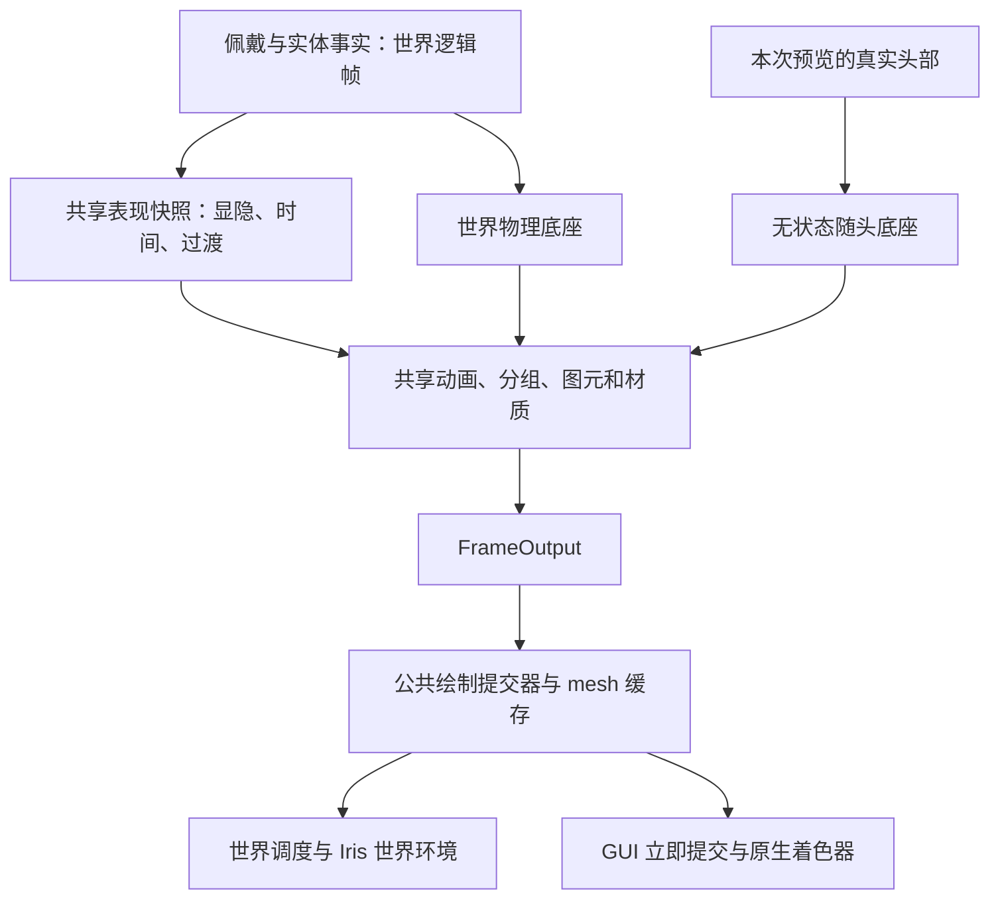

# 原版玩家预览光环（2.2.0 开发版）

## 行为与责任

所有调用 Minecraft 1.20.1 `InventoryScreen.drawEntity` 的玩家预览自动显示当前佩戴的光环，包括生存物品栏、创造模式的生存物品栏页。显示依据是共享佩戴及显隐状态；第一人称、世界模型不在镜头内不会抑制预览。打开 UI 不重播启动动画。

预览底座无物理、无阻尼。FREE／LOCKED／SYNC 使用同一刚性随头规则，在中立头部空间确定静态相对姿态，再跟随当前头部；保留定义偏移、缩放、静态变换和视觉动画。`face_camera` 使用正交预览相机的平行方向。billboard、ring、mesh 及其分组、材质、透明、遮罩由共享实现产生。



### Core

- `ClientRuntime` 实现新增的独立 `PreviewPort`，旧 `ClientPort` 无新必需方法。
- 世界逻辑帧先求值佩戴表现；每个 `PreviewSession` 只读取最新快照，以自己的几何收集器绘制。增加零次、一次或多次预览不改变世界物理、瞬移标记、生命周期或 `bodyPoses`。
- `PreviewFrame` 使用 core/JDK 类型，包含真实佩戴者 UUID/实体 ID、预览空间头部、相机、根矩阵、时间、光照和资源。会话本身就是视图身份，同 UUID 可同时出现在多个视图。
- 坐标以方块为单位，GUI 像素缩放、投影及镜像属于适配器。相机位置在场景空间减去后再乘根矩阵；默认正交投影。完整约定见 [core README](../core/README.md#preview-contract-since-220)。
- 不匹配的实体/资源代、缺少定义或有效表现时返回空输出。换世界、断线及完整同步替换使旧会话失效；关闭幂等。定义缺失不撤销佩戴，资源恢复后的下一个世界表现帧恢复输出。

### 1.20.1 Fabric 适配器

- 在原版底层四元数重载的 `runAsFancy` 调用周围创建可嵌套捕获作用域，`try-with-resources` 保证异常清理。
- 捕获本次原版 `ModelPart` 实际提交的头部矩阵，去掉完整 GUI 根变换，再复用世界头部数学。隐身跳过基础模型绘制时，读取同一原版模型在 `setAngles` 后的头部姿态作为回退。均不按实体身高或鼠标角度猜测。
- 捕获独立于世界缓存和 API v2；未得到有效原版头部时跳过。YSM／EMF 捕获器在预览作用域中跳过世界写入。
- 模型缓冲提交后，在 GUI 根矩阵恢复前立即提交全部光环；共用材质、mesh VBO/EBO 缓存、排序与重载。GUI 环境显式绕过 Iris 世界程序，无世界雾；保留满亮 lightmap、GUI 双方向光及 glow 语义。
- 提交器保存并恢复着色器、纹理、混合、剔除、深度写入/测试、缓冲绑定和颜色。投影、矩阵和裁剪不被提交器修改。模型和光环共享宿主的深度空间；自定义 UI 仍负责给模型及光环留出合适的视口、近裁剪面和尺寸。

客户端配置文件 `config/halo-azusake/halo_mod_config.json` 新增：

```json
{ "playerPreviewHaloEnabled": true }
```

旧文件缺少该项时自动补齐为 `true`；显式 `false` 保留，沿用修改后重启生效方式。

### 外部接入

客户端最小门面为 `network.azusake.halo.api.client.preview.v1.HaloPreviewApi`，提供原版玩家绘制包装、会话创建及显式 `PreviewFrame` 提交。原版函数已自动接入，不要重复包装。见 [中文 API](zh/API.md#player-preview-api) / [English API](en/API.md#player-preview-api)。

API v2 仍仅接受世界空间锚点。后续 YSM／EMF 和独立 UI 只需提供自己的头部捕获、佩戴者映射及会话作用域；后续物理应在会话内独立模拟，复用世界算法。本阶段没有实现这些兼容入口或预览物理。

YSM 世界兼容门槛仍为精确匹配 `2.6.5-fabric+mc1.20.1`；EMF 仍为 `3.1.1+` 且通过现有 ABI 检查。此次修改未提高或降低门槛。

## 验证记录（2026-09-15）

### 用户验收结论

- 原版玩家预览完全合格：三类图元可见、无光影路径、精准跟随头部、显示条件正确。
- 预览物理尚未实现，不予测评。
- YSM／EMF 接管玩家渲染后，当前实现没有获取它们的预览头部锚点，光环不可见。后续优先补齐该项。
- 用户确认 YSM 模型界面存在光环；记录为该界面的实测结果，不据此推断所有第三方 UI 都已兼容。
- EMF 验收必须启用实际接管玩家模型的资源包，仅安装 EMF 后检查光环是否可见不能证明兼容。

本次测试通过缓存目录中的临时 Fabric 测试入口驱动真实 Minecraft 界面和服务器，不把测试入口或测试资源打入 Halo 成品。所有临时脚本、隔离世界、截图和日志位于 `F:/codex-cache/halo-preview/`。

### 自动检查

- core 独立构建、Halo 联合构建及相关现有回归测试：core 287 项、Halo 97 项，均无失败、错误或跳过。
- 新增 `PreviewRuntimeTest`：三图元与世界输出一致、嵌套分组/动画/遮罩、随头旋转和偏移/缩放/镜像、零偏移、正交 `face_camera`、同 UUID 多会话、世界状态隔离、显隐/启停、缺失资源恢复、实体/资源代校验与会话失效。
- 新增 `PreviewHeadMathTest`：去掉像素平移/缩放/镜像根矩阵，恢复真实头部中心与四元数；非法根矩阵跳过。
- 旧配置补齐与显式禁用保留；新公开类型的 core/JDK 依赖边界检查。
- 冻结 2.1.2 `ClientPort` 的消费方编译及新 jar 链接检查；原有 API v2 编译消费方在最终 Halo jar 上运行。
- `HALO_YSM_TEST_JAR` 指定原始 YSM 2.6.5 发布包，原有签名检查通过。

### 已执行真实游戏检查

| 环境 | 已执行范围 | 证据目录 |
| --- | --- | --- |
| Minecraft 1.20.1 / Fabric Loader 0.15.11 / Java 17 / 原生渲染 | 生存物品栏、创造物品栏、三图元、同玩家双预览、头部俯仰、开关/取消佩戴、隐身允许/隐藏/恢复、正交朝向、遮罩、资源重载、GUI 缩放 | `evidence-final/` |
| Iris 1.7.6 + Sodium 0.5.13 + BSL v10.1.1 | 上述 16 个阶段，含配方书开启；GUI 光环与世界光影同时渲染 | `evidence-shaders/` |
| 独立 Halo 专用服 + Dev1 / Dev2 两客户端 | 双方预览同时显示两名玩家的 ring/billboard/mesh；取消、死亡重生、下界及返回主世界后恢复；检查真实同步状态及 GL/作用域 | `evidence-smokeClient/`、`evidence-smokeClient2/` |
| 禁用服务端 Halo 的独立测试服 + 客户端 Halo | 确认 LOCAL 阶段；本地佩戴 ring、切换 mesh、取消、恢复四阶段 | `evidence-local/` |
| 普通游戏启动环境 / Fabric Loader 0.19.3 / 原始 YSM 2.6.5 + EMF 3.1.1 + ETF 7.1 | 16 个 UI 阶段无 GL 错误或作用域泄漏；YSM 真实自定义玩家模型运行、世界捕获继续工作；准确预览锚点按本期范围跳过 | `evidence-production-compat/` |

单人原生和光影两组均检查到 `glError=0` 且绘制后无残留预览作用域。测试还断言嵌套异常退出可恢复外层作用域、世界头部缓存及实体角度未被预览改写、调用方混合/剔除/深度/颜色恢复。截图确认 GUI 文字和物品继续正常绘制。数值跟随及状态隔离由自动测试补充；截图本身不代表所有帧率、所有定义或所有光影包都已验收。

YSM 发布包的元数据不适合当前 Loom 1.5.8 的开发重映射，组合测试因此使用隔离的普通游戏启动环境和原始 JAR；未修改原始外部模组。该组合只证明本次 UI 路径没有干扰当前世界渲染与作用域，不计作 YSM／EMF 预览兼容验收。EMF 自定义 CEM 玩家资源包、三者与 Iris 同时安装的完整组合尚未实测。

仍需补充的人工验收包括：全部鼠标极限、连续窗口尺寸变化、第一/第三人称反复切换、真实睡眠过程和反复断线重连。相关坐标/睡眠/会话失效已有自动测试，但不将其写作这些人工场景通过。

### 交付与发布状态

从锁定基线建立两个工作分支：Halo `codex/player-preview-1.20.1`（基线 `ffefd071faf228f33dc1bb68a3e866a8e0ce6b13`），core `codex/player-preview`（基线 `f8c35bf39b2b38a9c31942bba80013e988e4debd`）。

功能版本为 core `2.2.0`、Halo `2.2.0+adapter.1`，当前为 `.dev` 构建。schema 1.1.0、存档、网络协议和 API v2 保持不变。发布另行进行；提交时先提交 core 源码，再由 Halo 锁定该提交，推送同样 core 在前。

用户验收后将第一阶段代码提交为本地检查点：先 core 源码，再 Halo 代码及 gitlink。尚未推送或创建发布标签。此前开发 JAR 的 `halo-build.json` 记录基线 SHA 与 `development=true`。
